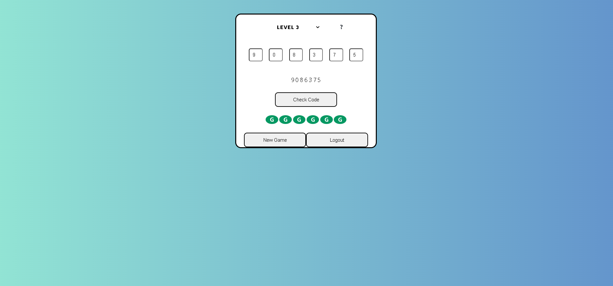

# CodeBlue

it is a sample game. build using MERN stack. and here is the deployed [link](https://www.google.com) - not yet deployed will be updatiung after deployment.

## Technology

React - Frontend  
Nodejs/Express - Backend  
MongoDB - Database

### Few Endpoints

/login   
/register   
/game   
